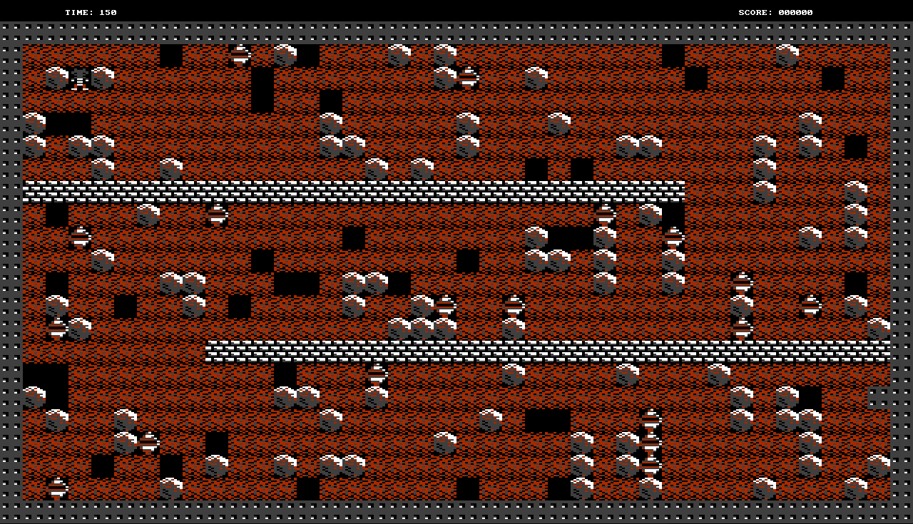

# BOULDER DASH



## START INSTRUCTIONS

### Basic Start
To play this game you must have installed both C and Allegro dependencies. If you do, run the following commands:

```bash
make
```

This will compile all the files, so the game will work as it should.

```bash
./play
```

This command will run the game, a screen must pop up with the map and all the others elements.

### Name Option

Every that you win or lose the game a score will be saved in `scores.txt`, if you don't provide any name your score will be saved as "Rockford".

But if you do want to provide a name, use this option:

```bash
./play -n your_name
```

## GAMEPLAY INSTRUCTIONS

* Move the character: use the `ARROW KEYS`
* Info screen: press `H` or `F1`
* Restart: press `ESC`
* Quit: press `Q` or close the window

## EASTER-EGG OR CHEAT CODE

There is a *cheat code* in this game that allows you to walk through the brick walls, but I'm not going to tell how to activate it. You need to find on your own...